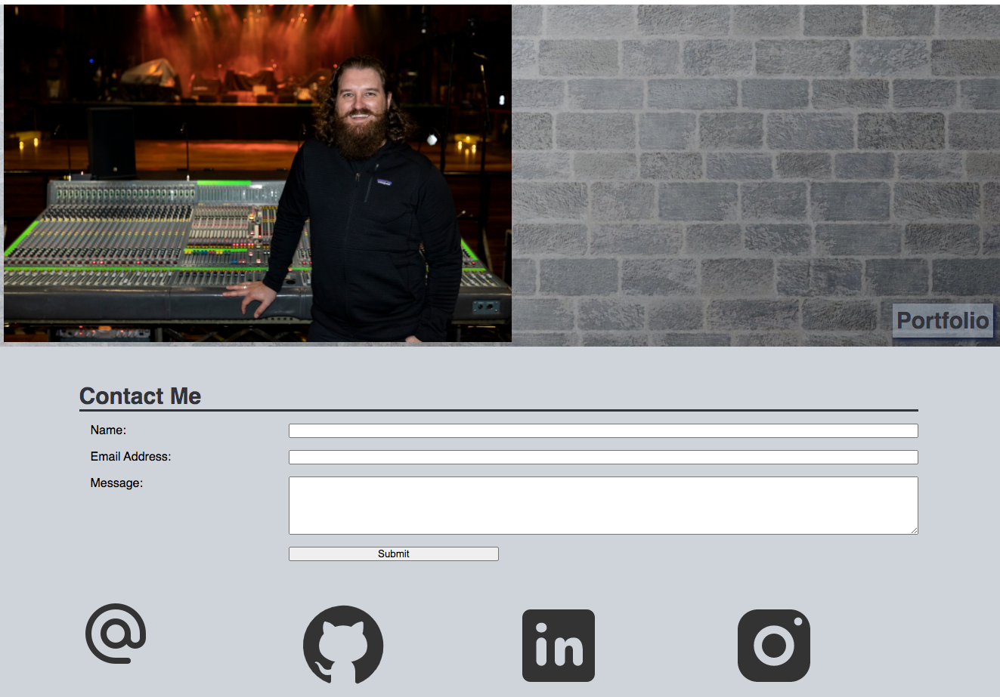

# React Portfolio
* A website that offers potential employers a chance to view my projects.

## Description
* This is a portfolio site built using React.  It features six of my recent projects, a short biography, contact form and info as well as my resume.

## Links
* [GitHub Repo Link](https://github.com/taylornyquist/react-portfolio)
* [Link to Deployed Application](https://taylornyquist.github.io/react-portfolio/)

## Screen Shots

## Table of Contents

* [Usage](#usage)
* [Technology](#technology)
* [Questions](#questions)
* [Contribution](#contribution)

## Usage
Visit the GitHub [link](https://taylornyquist.github.io/react-portfolio/) to view the deployed application.

## Technology
This application used the following technology:

* HTML
* CSS
* JavaScript
* Node.js
* React
* Bootstrap

## Questions
If you have any questions about the repo, open an issue or contact me directly at tnyquist@gmail.com.  You can find more of my work at [taylornyquist](https://github.com/taylornyquist).

## Contribution
* Taylor Nyquist